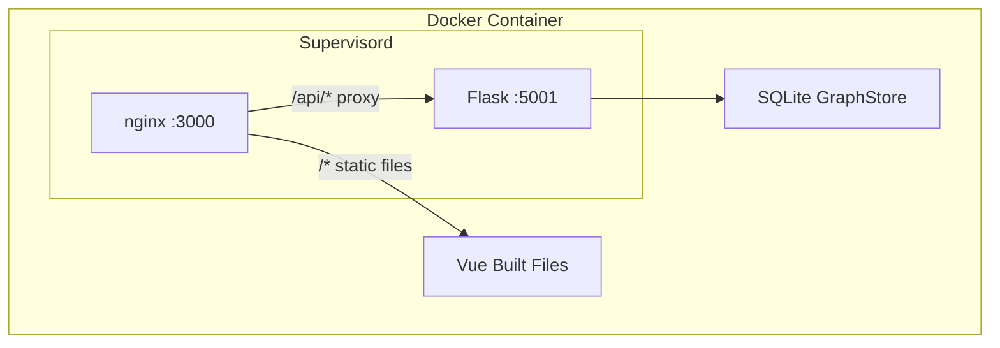

# Dextora Foresight — Deployment Guide

This guide explains how to deploy the Dextora Foresight application using Docker.
The application consists of a Vue build, Nginx reverse proxy, Flask backend API, and a local SQLite database for graph memory. No external database or setup is required!

## Prerequisites

1. **Docker Desktop** (or Docker Engine + Docker Compose) installed on the host machine.
2. A **Gemini API Key** from [Google AI Studio](https://aistudio.google.com/app/apikey).

## Setup Instructions

**1. Clone the repository / download the code.**

**2. Configure Environment Variables:**
Copy the example environment file and add your actual API keys.
```bash
# On Linux/Mac:
cp .env.example .env

# On Windows (PowerShell):
Copy-Item .env.example -Destination .env
```
Open `.env` and fill in `LLM_API_KEY` with your Gemini API key. *(Note: `ZEP_API_KEY` is NOT required).*

**3. Build and Start the Application:**
We use a multi-stage Docker build to compile the frontend and set up the backend environments automatically.

```bash
docker compose up -d --build
```
This single command will:
- Build the Vue frontend
- Install Python requirements
- Start Nginx and the Flask backend using Supervisord
- Set up a Docker Volume mapping so your SQLite database and file uploads are preserved even if the container restarts.

## Accessing the Application

Once Docker says the container is "Running" or "Healthy":
- Open your browser to **http://localhost:3000**
- You should see the Dextora Foresight homepage.

## Troubleshooting

- **Backend errors / API timeouts?** Ensure the `LLM_API_KEY` in the `.env` file is valid and has sufficient quota.
- **Where is the database?** The SQLite database will be created automatically in `/backend/data/` inside the container, mapping to `./backend/data` on your host.
- **Need to check logs?** Run `docker compose logs -f mirofish` to view real-time logs from both Nginx and Flask.

## Architecture


